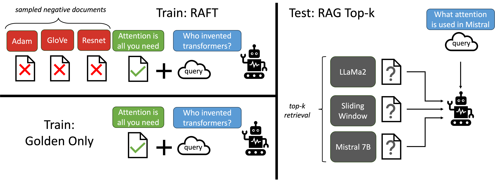

## RAFT Fine-Tuning for RAG Using Azure OpenAI GBB Workshop

This repository provides a step-by-step guide on how to implement Retrieval Augmented Fine Tuning using Azure OpenAI. The repository is meant to be educational rather than a production ready implementation of RAFT. 

**Scenario** You are a developer at a bank working on a conversational assistant capable of answering questions about the bank's accounts and online tools. You have already tried Prompt Engineering and RAG but the business stakeholders still complain about incorrect answers and a general lack of domain adaptation. You suggest trying out RAFT as a potential solution and want to validate the efficacy of such a technique for this use case.

###  RAFT: Adapting Language Model to Domain Specific RAG 📚
Retrieval Aware Fine-Tuning (RAFT), presents a novel recipe to prepare fine-tuning data to tailor the models for domain-specific open-book setting, equivalent to in-domain RAG. In RAFT, we prepare the training data such that each data point contains a question ( Q ), a set of documents (Dk), and a corresponding Chain-of-though style answer (A*) generated from one of the document (D*). We differentiate between two types of documents: oracle documents (D*) i.e. the documents from which the answer to the question can be deduced, and `distractor' documents (Di) that do not contain answer-relevant information. As an implementation detail, the oracle document doesn't need to be a single document, but can be more than one document, as is the case in HotpotQA. Then, for $P$ fraction of the questions (qi) in the dataset, we retain the oracle document (di*) along with distractor documents (dk-1). For (1-P) fraction of the questions (qi) in the dataset, we include no oracle document and only include distractor documents (dk). We then fine-tune the language model using standard supervised training (SFT) technique, training it to generate answers from the provided documents and question. The figure below illustrates the high-level design principal for RAFT.

We demonstrate that our RAG approach trains the model to perform better RAG on the set of documents it is trained on i.e., in-domain. By removing the oracle documents in some instances of the training data, we are compelling the model to memorize domain-knowledge. The training data for RAFT is as follows, and an example training data can be seen in the figure below:



Paper: https://arxiv.org/abs/2403.10131

### Getting Started

By design, this workshop only uses **Azure OpenAI service**. 

1. Deploy required models
For the workshop, you'll need GPT-4o, ada-002 embedding as well as GPT-4o-mini, make sure you deploy them
2. Create and populate your credentials
Open the [sample.env](./sample.env) file, copy its content into a new `.env` file and fill the required credentials. Note that the FINETUNED model credentials can only be populated after running through notebook 2.
3. Install dependencies

install system dependencies:

- on Linux run `sudo apt-get install -y poppler-utils`
- on Mac run `brew install poppler`
- On Windows run `conda install -c conda-forge poppler`

Install Python dependencies:
```shell
conda create -n raft python=3.11

conda activate raft

pip install -r requirements.txt
```
4. Go through the 3 notebooks in order, execute all the cells in order 


