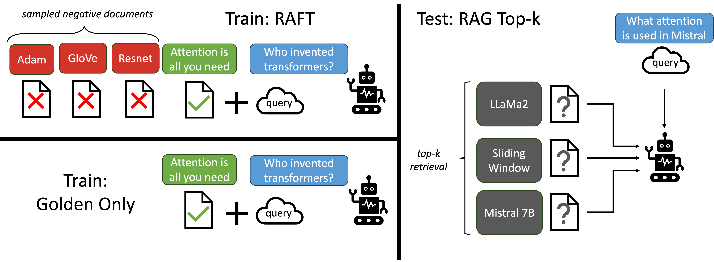

## RAFT Fine-Tuning for RAG Using Azure OpenAI GBB Workshop

###  RAFT: Adapting Language Model to Domain Specific RAG 📚
Retrieval Aware Fine-Tuning (RAFT), presents a novel recipe to prepare fine-tuning data to tailor the models for domain-specific open-book setting, equivalent to in-domain RAG. In RAFT, we prepare the training data such that each data point contains a question ( Q ), a set of documents (Dk), and a corresponding Chain-of-though style answer (A*) generated from one of the document (D*). We differentiate between two types of documents: oracle documents (D*) i.e. the documents from which the answer to the question can be deduced, and `distractor' documents (Di) that do not contain answer-relevant information. As an implementation detail, the oracle document doesn't need to be a single document, but can be more than one document, as is the case in HotpotQA. Then, for $P$ fraction of the questions (qi) in the dataset, we retain the oracle document (di*) along with distractor documents (dk-1). For (1-P) fraction of the questions (qi) in the dataset, we include no oracle document and only include distractor documents (dk). We then fine-tune the language model using standard supervised training (SFT) technique, training it to generate answers from the provided documents and question. The figure below illustrates the high-level design principal for RAFT.

We demonstrate that our RAG approach trains the model to perform better RAG on the set of documents it is trained on i.e., in-domain. By removing the oracle documents in some instances of the training data, we are compelling the model to memorize domain-knowledge. The training data for RAFT is as follows, and an example training data can be seen in the figure below:

https://arxiv.org/abs/2403.10131

